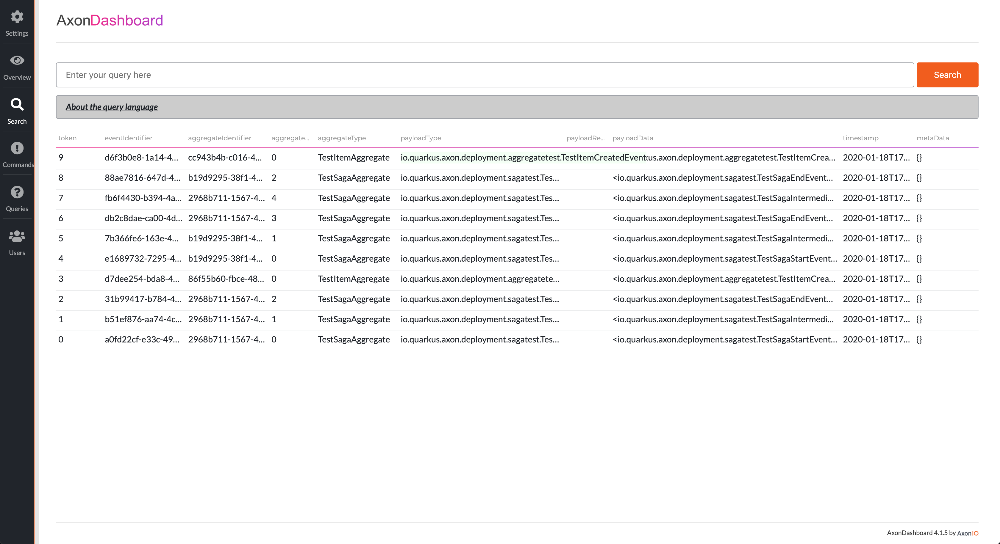

# quarkus-axonframework-extension
Quarkus Axon Framework extension

This extension add [Axon Framework](https://axoniq.io) support for the [Quarkus Framework](https://quarkus.io/). 

### Current project status:
The extension is **not** working right now. I'm busy with converting the extension code from the Quarkus core project (in my own custom branch) to a new structure where the extension is in its own repository as a separate project (like the Camel extensions).

The integration tests pass and the interfacing with Axon Server is successful

Todos:
- Code cleanup
- Solve issue with integration tests that they can't be enabled (Axon server can't run in embedded mode)
- Maybe add some more unit tests
- Connect with Quarkus build process to include it in the release (requires PR)
- Test with GraalVM
